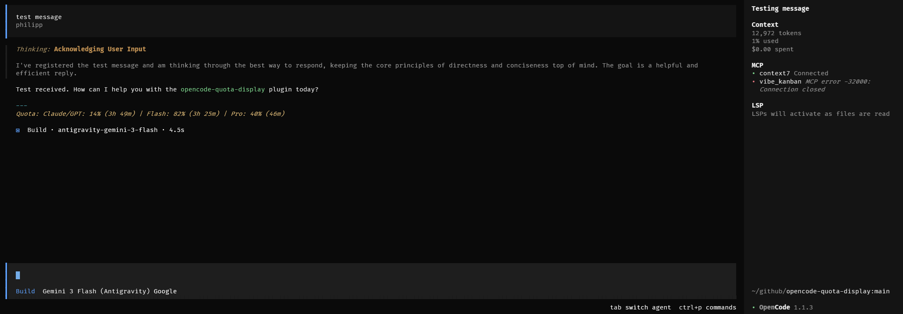

# Opencode Antigravity Quota

An Opencode TUI plugin and CLI tool to display remaining Antigravity model quotas.



> **⚠️ Requirement**: Antigravity should be running in the background for this tool to retrieve quota data.

## Features

- **TUI Integration**: Displays remaining quota information inside the Opencode TUI.
- **CLI Tool**: Quick terminal check for all model categories (Flash, Pro, Claude/GPT/OSS).
- **JSON Output**: Machine-readable quota data for scripting.

## Important Prerequisites

This plugin retrieves data directly from the **local Antigravity Language Server**. It does **not** handle authentication or start the server.

For this to work, you must satisfy one of the following:

1. Run an IDE with Antigravity/Windsurf open, authenticated, so it starts the language server.
2. Run the `language_server` process manually (authenticated) on the same machine/container as Opencode.

If Opencode is running in WSL, the Antigravity server must also be running inside WSL.

## Installation (Opencode)

Add the plugin to your Opencode config (`opencode.json`):

```json
{
  "plugin": ["opencode-ag-quota"]
}
```

## Configuration (Quota Display)

Create `.opencode/ag-quota.json` (project-local) or `~/.config/opencode/ag-quota.json` (global).

```json
{
  "format": "{category}: {percent}% ({resetIn})",
  "separator": " | ",
  "displayMode": "all",
  "alwaysAppend": true
}
```

### Options

| Option | Type | Default | Description |
|--------|------|---------|-------------|
| `format` | string | `"{category}: {percent}% ({resetIn})"` | Format string applied per category |
| `separator` | string | `" \| "` | Separator between categories when `displayMode` is `all` |
| `displayMode` | `"all"` \| `"current"` | `"all"` | Show all quotas, or only the current model’s quota |
| `alwaysAppend` | boolean | `true` | Append an "Unavailable" line when quota can’t be read |

### Format Placeholders

- `{category}` - Category name (Flash, Pro, Claude/GPT)
- `{percent}` - Quota percentage (e.g., "85.5")
- `{resetIn}` - Relative time until reset (e.g., "2h 30m")
- `{resetAt}` - Absolute reset time (e.g., "10:30 PM")
- `{model}` - Current model ID

## CLI Usage

The library package also provides a CLI:

```bash
npx ag-quota
```

```
Antigravity Quotas (Retrieved at: 10:34:53 PM):
------------------------------------------------------------
Claude/GPT/OSS      :  14.7% remaining (Resets in: 3h 58m)
Gemini Flash        :  81.8% remaining (Resets in: 3h 34m)
Gemini Pro          :  45.3% remaining (Resets in: 55m)
```

```bash
npx ag-quota --json
```

```json
{
  "timestamp": 1767735298099,
  "categories": [
    {
      "name": "Claude/GPT/OSS",
      "remainingFraction": 0.14666666,
      "remainingPercentage": 14.7,
      "resetTime": "2026-01-07T01:33:34Z",
      "resetsIn": "3h 58m"
    },
    {
      "name": "Gemini Pro",
      "remainingFraction": 0.453125,
      "remainingPercentage": 45.3,
      "resetTime": "2026-01-06T22:30:14Z",
      "resetsIn": "55m"
    },
    {
      "name": "Gemini Flash",
      "remainingFraction": 0.8175,
      "remainingPercentage": 81.8,
      "resetTime": "2026-01-07T01:09:14Z",
      "resetsIn": "3h 34m"
    }
  ]
}
```

## Credits

Discovery logic inspired by `ag-usage`.

## License

MIT
